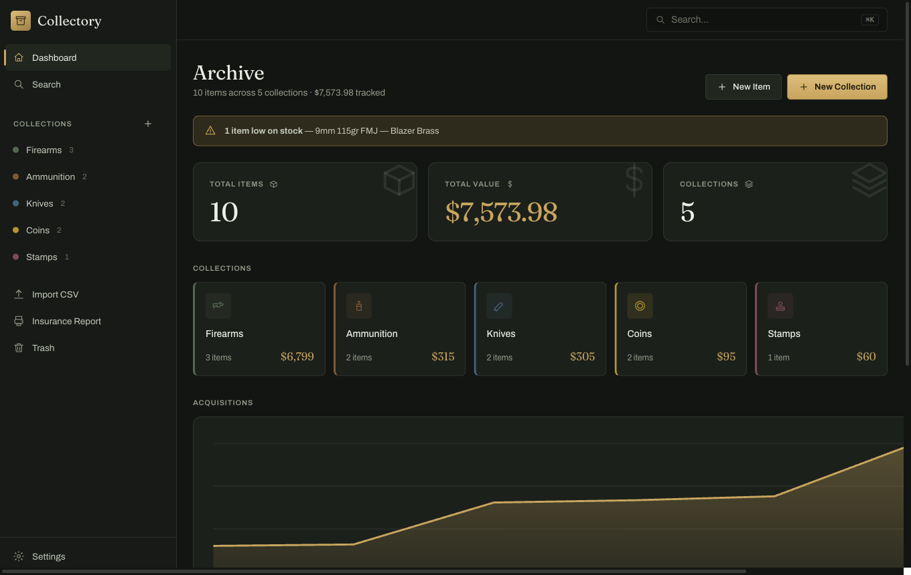
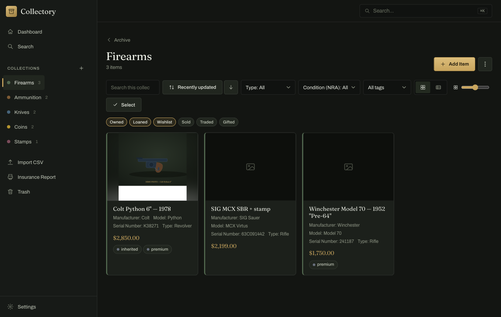
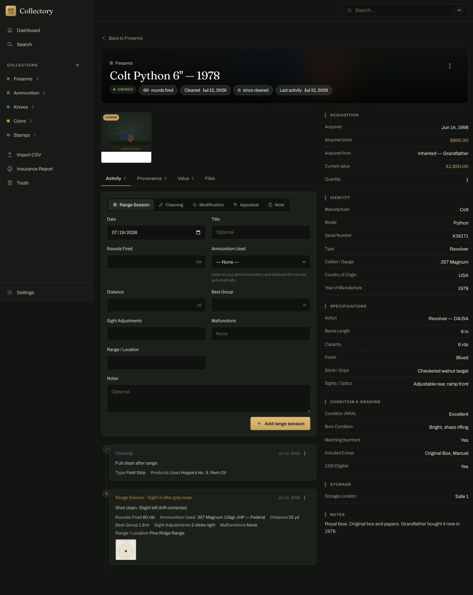
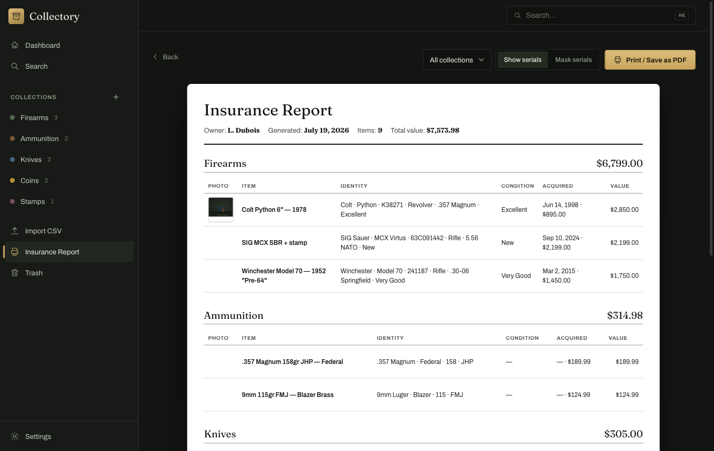

# The Collectory

**Your collections. Your machine. Nobody else's business.**

The Collectory is a local-first collection manager for firearms, ammunition, magazines, accessories,
parts, knives, coins, stamps — and any custom collection you define. Everything lives in a SQLite
database and an image library on your own Mac. **No servers, no cloud, no accounts, no telemetry.**
Your records never leave your machine unless you export them.

## What it does

- **Built-in expert templates** — Firearms (NRA condition grading + a full NFA/tax-stamp section),
  Ammunition (lot tracking, low-stock alerts), Magazines (as child records of a firearm — capacity,
  loaded state), Accessories and Parts (linked to the firearms they fit), Knives (steels, grinds,
  locks, NKCA grading), Coins (Sheldon scale, certification, CAC, pedigrees), Stamps (Scott +
  alternate catalogs, perforation/watermark, gum/hinge, plate blocks). Plus fully custom
  collections. Every field of every collection is editable: add, remove, reorder, re-type.
- **Activity logs with photos** — range sessions with target photos, cleaning, modifications,
  sharpening, grading submissions, appraisals, or your own log types.
- **The range loop** — log a range session on a firearm, pick the ammo used, and The Collectory
  deducts the rounds from your ammo inventory and updates the gun's lifetime round count (computed
  from logs — it reverses exactly and can't drift), tracks rounds since last cleaning, and warns
  when ammo stock runs low.
- **Cross-links** — accessories, parts, and magazines associate with firearms; a gun's detail page
  shows what fits it and what ammo it uses.
- **Provenance & value** — ownership chains, valuation history with sources, current-vs-paid
  tracking, receipts/certificates attached to items.
- **Insurance report** — printable, PDF-ready inventory with photos, serials (maskable), and totals.
- **CSV round-trip** — column-mapped bulk import (auto-maps to the target collection's fields, brings
  a myArmsCache export in in minutes) and full export, with a stable id column so
  export → edit in Excel → re-import updates instead of duplicating, preserving multi-select /
  checkbox / number types. Plus one-file full backup (database + all images) and automatic daily
  local backups.
- **iPad, without the cloud** — flip on LAN access in Settings, scan the QR code, and Add to Home
  Screen. Optional PIN protects LAN access. Nothing ever touches the internet.
- **Sortable, editable table view** — click any column to sort (including custom fields);
  double-click a cell to edit inline; a pencil opens a slide-over editor.
- **In-app updates** — Check for Updates offers new signed, notarized versions with one click.

## Screenshots

| | |
|---|---|
|  |  |
|  |  |

## Install (macOS)

1. Download the latest `Collectory-arm64.dmg` (Apple Silicon) or `Collectory-x64.dmg` (Intel) from
   [Releases](../../releases), or from the [download page](https://shopengineering.github.io/collectory/).
2. Open the DMG and drag **The Collectory** to Applications.
3. Double-click to open. The app is signed with a Developer ID and notarized by Apple, so it opens
   normally — no Gatekeeper warnings, no Terminal steps.

Your data lives in `~/Library/Application Support/Collectory/` (database, images, attachments,
automatic backups; the folder keeps its original name regardless of the app's display name). Copy
that folder — or use **Settings → Backup Now** — and you have everything.

## iPad setup

1. On the Mac: **Settings → LAN Access** → enable, optionally set a PIN. Keep The Collectory running.
2. On the iPad (same Wi-Fi): scan the QR code or type the shown address into Safari.
3. Share → **Add to Home Screen**. On iPadOS 26+ it opens as a full-screen app.

The Mac is the home base; the iPad reads from it live over your Wi-Fi. Nothing goes over the internet.

## Migrating from myArmsCache

In myArmsCache: **Support → Export Data** to get a CSV per category. In The Collectory: create the
matching collection (e.g. New Collection → Firearms), then **Import CSV**, pick that collection and
the file — columns auto-map to the fields. Repeat per category. Photos aren't in CSV exports, so add
those afterward.

## For developers

```bash
npm install                 # root deps (Express, better-sqlite3, Electron…)
npm --prefix client install # frontend deps
npm run dev                 # headless server (:7117) + Vite dev client (:5173)
npm run dev:app             # Electron shell against the dev servers (run rebuild:electron first)
npm test                    # backend test suite (node:test + supertest) — 57 tests
npm run dist                # build client + package a signed DMG (output in release/)
```

- Architecture, full data model, and API contract: `docs/specs/DESIGN.md`. Project index and current
  state: `docs/specs/00-PROJECT-INDEX.md`. Latest security/architecture review is summarized in
  `03-roadmap-and-remaining-work.md`.
- `server/` — Express + better-sqlite3 (CommonJS). `client/` — React + TypeScript + Vite PWA.
  `electron/` — desktop shell that runs the same server in-process.
- Native-module note: `npm install` keeps better-sqlite3 on your system-Node ABI (tests/dev);
  `npm run rebuild:electron` / `npm run rebuild:node` switch between Electron and Node ABIs.
  Local native builds need Node ≥20 and a Python with `setuptools`.
- Signing & releases: builds are signed with a Developer ID and notarized. A `v*` tag triggers
  GitHub Actions to build arm64 + x64 DMGs — but the workflow **skips unless all signing +
  notarization secrets are present** (never ships an unsigned/blocked build). Until those secrets
  are set, releases are built and notarized locally.

## Data philosophy

Plain SQLite you can open with any tool, images as ordinary files, free CSV/JSON export forever, and
an open documented schema. If this app disappeared tomorrow, your records would still be yours,
readable, and portable — that's the point.

## License

MIT
